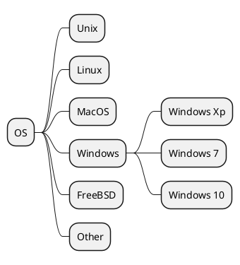

# 一级标题

## 二级标题

. . .

- 一级标题 水平构建

. . .

- 二级标题 垂直构建

## 中间三个大点 - 停顿一下

. . .

就像这样

```text
content before the pause

. . .

content after the pause
```

. . .

# 如何生成 HTML？

## 一行命令

```bash
pandoc -t revealjs -s revealjs.md -o revealjs.html
```

. . .

如果嫌加载慢，可以再加一个参数

```bash
-M revealjs-url=https://cdn.jsdelivr.net/npm/reveal.js@4
```

## 主题？

. . .

这么配置

```bash
pandoc -t revealjs -V theme=serif -s revealjs.md -o revealjs.html
```

## 更多主题以及文档

- <https://revealjs.com/themes/>

- <https://pandoc.org/MANUAL.html#slide-shows>

# 测试

## [Notes](https://pandoc.org/MANUAL.html#speaker-notes)

若要显示备注窗口，请在查看演示文稿时按 `s`

::: notes

This is my note.

- It can contain Markdown
- like this list

这玩意可以当提词器用，哈哈

:::

## [Columns](https://pandoc.org/MANUAL.html#columns)

:::::::::::::: {.columns}
::: {.column width="40%"}
contents...
:::
::: {.column width="60%"}
contents...
:::
::::::::::::::

## [数学公式](https://pandoc.org/MANUAL.html#frame-attributes-in-beamer){.fragile}

. . .

块内公式

$$x=\frac{-b\pm\sqrt{b^2-4ac}}{2a}$$

. . .

行内公式

$x=\frac{-b\pm\sqrt{b^2-4ac}}{2a}$

. . .

其实不用`{.fragile}`属性，直接写公式也行

## 表格

| 实验组 | 时间 |   数量 |
| :----- | :--: | -----: |
| M1     |  1h  | 120000 |
| M2     |  2h  | 140000 |
| M3     |  3h  | 160000 |

## 表格 扩展语法

| 实验组 | 时间 |   数量 |
| :----- | :--: | -----: |
| M      |  1h  | 120000 |
| ^      |  2h  | 140000 |
| ^      |  3h  | 160000 |

---

| 实验组 | 时间 |   数量 |
| :----- | :--: | -----: |
| >      | xxx  |        |
| M2     |  2h  | 140000 |
| M3     |  3h  | 160000 |

---

| 实验组 | 时间 |   数量 |
| :----- | :--: | -----: |
| M1     |  >   |    xxx |
| M2     |  2h  | 140000 |
| M3     |  3h  | 160000 |

---

**好吧，看来不支持**

## [PlantUML](https://plantuml.com/zh/) and [Mermaid](https://mermaid.js.org/intro/n00b-syntaxReference.html)

:::::::::::::: {.columns}
::: {.column width="50%"}



:::
::: {.column width="50%"}


:::
::::::::::::::

---

**也不支持。。。**

. . .

**没搜到解决方案**

. . .

**看来目前只有普通的代码高亮是开箱即用的**

. . .

**(눈益눈)**

## 看一下地球，放空一下

---


# Over
